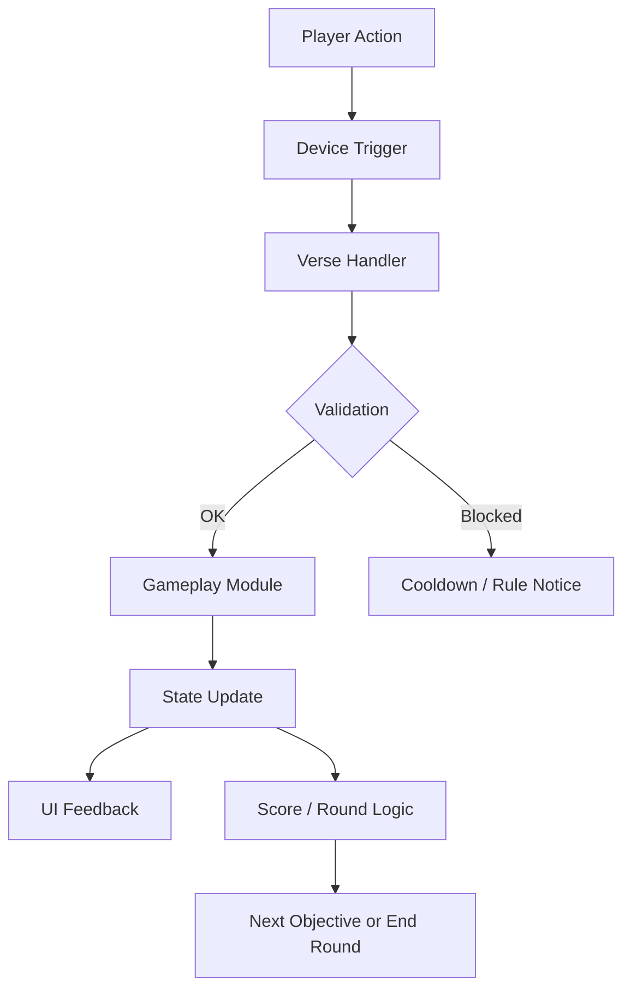

# Fortnite Scripts Suite (UEFN Verse Toolkit)

If you searched for “Fortnite scripts,” you might mean one of two worlds: the messy one (rule-breaking tools) or the creative one (legit automation for islands). This project lives firmly in the second world—clean, creator-friendly scripting that helps you ship better UEFN experiences with fewer late-night bugs and fewer “why is the timer stuck” mysteries.

**Fortnite Scripts Suite** is a curated toolbox of **Verse modules, device templates, and workflow helpers** designed for faster iteration, consistent gameplay logic, and easier collaboration.

## What this repository is

* A **Verse module library** (drop-in mechanics like rounds, scoring, loadouts, cooldowns)
* A set of **UEFN device templates** (patterns for triggers, UI, objectives, spawners)
* A lightweight **project workflow** (naming conventions, version notes, sanity checks)

> [!IMPORTANT]
> This repo is for **UEFN / Verse** creation and island logic. It does **not** provide or support anything that breaks Epic’s rules or compromises fair play.

---

## Quick Start ⚡️

Clone the repo and explore examples first—your future self will thank you.

```bash
git clone https://github.com/yourname/fortnite-scripts-suite.git
cd fortnite-scripts-suite
```

Recommended layout inside your UEFN project:

```text
/Verse
  /FSS
    /Core
    /Gameplay
    /UI
  /YourIsland
    main.verse
```

Add modules gradually. Start with **Core** utilities, then pull in gameplay features you actually need.

---

## Core Modules 👁️‍🗨️

Think of these as the quiet gears behind your island—small pieces that keep everything smooth.

* **Config Layer**: centralizes tunables (timers, score values, round limits) so balance tweaks don’t become a scavenger hunt.
* **Event Bus**: a neat pattern for broadcasting gameplay events (elimination, capture, checkpoint) without tangled dependencies.
* **Cooldown + Rate Limits**: prevents spam interactions and keeps input handling predictable.
* **State Helpers**: “round started,” “match paused,” “overtime”—stored in one reliable place.

### Example: simple cooldown guard (pattern)

```verse
# Pseudocode-style pattern; adapt to your Verse version and project structure.
if Cooldowns.CanUse(Player, "Dash"):
    Cooldowns.Use(Player, "Dash", Seconds := 6.0)
    DoDash(Player)
```

---

## Gameplay Pack 🎯

Where the fun lives—modules that feel like building blocks, not monoliths.

* **Round Controller**: best-of-N, sudden death, overtime logic
* **Score Manager**: team or FFA scoring, multipliers, streak bonuses
* **Loadout Router**: grant items by class, team, zone, or progression tier
* **Objective System**: capture points, payload checkpoints, item deliveries
* **Spawn Director**: spawn waves, safe spawns, anti-repeat spawn zones

> [!NOTE]
> The strongest islands aren’t the most complex—they’re the most *consistent*. Small, testable modules beat one giant “god script” every time.

---

## UI & Feedback Layer 🧭

Players don’t just need mechanics—they need clarity.

* **HUD messaging helpers** (short, timed notices)
* **Objective prompts** (what to do, where to go, what changed)
* **Round summaries** (who won, why, and what’s next)
* **Debug toggles** (creator-only overlays and logs)

---

## Recommended Workflow 🛠️

A good toolkit is also a rhythm.

1. **Start with one mechanic** (e.g., scoring).
2. **Add one feedback channel** (HUD prompt).
3. **Test a single loop** (spawn → objective → score → round end).
4. **Only then** expand: streaks, overtime, loadouts, progression.

### Optional: lightweight linting / consistency checks

If you keep docs or config files in JSON/YAML, add a tiny Node toolchain:

```bash
npm init -y
npm i -D prettier
npx prettier -w .
```

---

## How modules flow (Mermaid) 🌊



---

## FAQ 🙋‍♂️

**Does this include anything for cheating or unfair advantages?**
No. This repo is strictly for **legitimate UEFN / Verse** island scripting—tools that help creators build gameplay, UI, and logic in a clean, maintainable way.

**How do I pick which modules to use first?**
Start with **Round Controller + Score Manager**. Once rounds feel good, layer in **objectives**, then polish with **UI prompts**.

**Will this hurt performance on busy islands?**
The modules are intended to be lightweight and event-driven. Avoid overly frequent tick-style loops; prefer triggers and state changes.

**How do updates work without breaking my island?**
Use semantic versioning in your own project notes. Pull updates module-by-module (copy the folder you need), and keep a small changelog for your island.

**Can I contribute?**
Yes—add a module with a short README: what it does, what it depends on, and one example usage pattern. Small contributions are like sparks: they catch.

---

## Final Thoughts ✨

UEFN creation is part engineering, part storytelling. Your code is the unseen narrator: it decides when tension rises, when rewards land, when a match feels fair, and when players say, “one more round.”

If you want a toolkit that keeps your Verse logic tidy, reusable, and easier to ship—**Fortnite Scripts Suite** is built for that.
